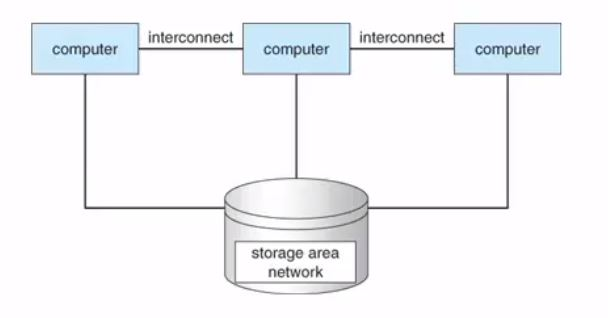

# 1. 서론

### ***1.2 컴퓨터 시스템의 구성***

****

컴퓨터 시스템은 하나 이상의 CPU와 구성요소와 공유 메모리 사이의 액세스를

제공하는 공통 **버스**를 통해 연결된 여러 장치 컨트롤러로 구성된다.

장치 컨트롤러는 일부 로컬 버퍼 저장소와 특수 목적 레지스터 집합을 유지, 관리하며

제어하는 주변 장치와 로컬 버퍼 저장소 간에 데이터를 이동한다.

*로컬 버퍼 저장소: 각 장치마다 제어하기 위해 설치된 장치 컨트롤러에 장치로부터

들어오고 나가는 데이터를 임시로 저장하기 위한 작은 메모리

일반적으로 운영체제에는 각 장치 컨트롤러마다 **장치 드라이버**가 있다.

CPU와 장치 컨트롤러는 병렬로 실행되어 메모리 사이클을 놓고 경쟁한다.

공유 메모리를 질서 있게 액세스 하기 위해 메모리 컨트롤러는 메모리에 대한 액세스를 동기화한다.

***1.2.1 인터럽트***

하드웨어는 언제든 시스템 버스를 통해 CPU에 신호를 보내 인터럽트를 발생시킬 수 있다.

인터럽트는 운영체제와 하드웨어의 상호 작용 방식의 핵심 부분이다.

CPU가 인터럽트 되면 CPU는 하던 일을 중단하고 즉시 고정된 위치로 실행을 옮긴다.

(고정된 위치는 일반적으로 인터럽트를 위한 서비스 루틴이 위치한 시작 주소)

그리고 서비스 루틴이 실행되며 실행 완료 시 CPU는 인터럽트 되었던 연산을 재개한다.

인터럽트는 매우 빈번히 발생하므로 빠르게 처리되어야 한다.

필요한 속도를 제공하기 위해 인터럽트 루틴에 대한 포인터들의 테이블을 대신 이용할 수 있는데

이런 경우 중간 루틴을 두지 않고 테이블을 통해 간접적으로 인터럽트 루틴이 호출될 수 있다.

(인터럽트 핸들러 또는 인터럽트 서비스 루틴은 인터럽트 접수에 의해 발생되는

인터럽트에 대응하여 특정 기능을 처리하는 기계어 코드 루틴이다.)

인터럽트 구조는 인터럽트된 모든 정보를 저장해야 인터럽트 처리 후 정보를 복원할 수 있다.

만약 인터럽트 루틴이 처리기의 상태를 변경할 필요가 있다면 반드시 명시적으로

현재 상태를 저장해야 하며, 복귀 전 상태를 복원해야 한다.

인터럽트 서비스 ➝ 복귀 주소를 프로그램 카운터에 적재 ➝ 중단되었던 연산 다시 시작

(상태 저장 ➝  인터럽트 원인 확인 ➝  필요한 처리 수행 ➝  상태 복원)

장치 컨트롤러: 인터럽트 요청 라인에 신호를 선언하여 인터럽스 발생

CPU: 인터럽트를 포착하여 인터럽트 핸들러로 디스패치

핸들러: 장치를 서비스하여 인터럽트를 지움

CPU의 2가지 인터럽트 요청 라인

1. 마스크 불가능 인터럽트 (복구할 수 없는 메모리 오류)

2. 마스킹 가능

인터럽트가 발생하면 요청을 처리할 수 있는 핸들러가 발견될 때까지

상응하는 리스트의 핸들러가 하나씩 호출된다.

이러한 구조는 큰 크기의 인터럽트 테이블의 오버헤드와

하나의 인터럽트 핸들러로 디스패치하는 비효율성의 절충안이다.

*오버헤드: 어떤 처리를 하기 위해 들어가는 간접적인 처리 시간 • 메모리

인터럽트 기법은 **우선순위 레벨**을 구현하므로  CPU는 모든 인터럽트를 마스킹하지 않고도

우선순위가 낮은 인터럽트 처리를 연기할 수 있고, 우선순위가 높은 인터럽트가 실행을 선점할 수 있다.

인터럽트는 비동기 이벤트를 처리하기 위해 사용되며 시간에 민감한 처리에 빈번히 사용되므로

시스템 성능을 좋게 하려면 효율적인 인터럽트 처리가 필요하다.

***1.2.2 저장장치 구조***

****

CPU는 메모리에서만 명령을 적재할 수 있으므로 실행하려면 프로그램을 먼저 메모리에 적재해야한다.

프로그램 대부분은 메인 메모리(random-access-memory = **RAM**)라

불리는 재기록 가능한 메모리에서 가져온다.

컴퓨터 전원을 켤 때 가장 먼저 실행되는 프로그램은 **부트스트랩 프로그램**이며 운영체제를 적재한다.

RAM은 **휘발성**이므로 부트스트랩 프로그램을 유지하는 용도로 사용할 수 없다.

대신 읽기 전용 메모리(EEPROM) 및 기타 형태의 **펌웨어**를 사용한다.

*EEPROM: 전기적으로 소거 가능한 읽기 전용 메모리, 변경할 수 있지만 자주 변경할 수 없고 속도도 느리다.

*펌웨어: 쓰기 작업이 자주 발생하지 않고 비휘발성인 저장장치

*적재 명령: 메인 메모리로부터 CPU 내부의 레지스터로 한 바이트 또는 한 워드를 옮기는 것

*저장 명령: 레지스터의 내용을 메인 메모리로 옮기는 것

**폰 노이만 구조 시스템**에서 실행되는 명령-실행 사이클은

메모리로부터 명령 인출 ➝ 명령 레지스터에 저장 ➝ 명령 해독 ➝ 내부 레지스터에 저장

메모리 장치는 일련의 메모리 주소만을 인식하며 주소가 어떻게 생성되었는지는 알지 못한다.

우리는 단지 실행 중인 프로그램에 의해 생성된 일련의 메모리 주소에만 흥미가 있다.

이상적으로는 프로그램과 데이터가 메인 메모리에 영구히 존재하기를 원하지만 두 가지 불가능한 이유가 있다.

1. 메인 메모리는 모든 필요한 프로그램과 데이터를 영구히 저장하기엔 너무 작다.

2. 메인 메모리는 전원이 공급되지 않으면 그 내용을 잃어버리는 휘발성 저장장치이다.

컴퓨터 시스템은 메인 메모리의 확장으로 보조저장장치를 제공한다.

보조저장장치의 주요 요건은 대량의 데이터를 영구히 보존할 수 있어야 한다는 점이다.

가장 일반적인 보조저장장치는 하드 디스크 드라이브(**HDD**)와 **비휘발성 메모리(NVM) 장치**가 있다.

**3차 저장장치**: 저장된 자료의 백업 사본을 저장하기 위해 특수 목적으로만 사용하기에 매우 느리고 충분히 큰 장치

다양한 저장장치 시스템 간의 주요 차이점은 속도, 크기 및 휘발성에 있다.

                                                                   저장장치 계층구조

- 비휘발성 저장 장치의 두 가지 유형

1. 기계적: HDD, 광 디스크, 자기 테이프

2. 전기적: (플래시 메모리, FRAM, NRAM, SSD) = NVM

용량: 기계적 저장장치 > 전기적 저장장치

비용: 기계적 저장장치 < 전기적 저장장치

속도: 기계적 저장장치 < 전기적 저장장치

***1.2.3 입출력 구조***

****

**직접 메모리 액세스(DMA)**: NVS I/0 와 같은 대량의 데이터 이동 시 높은 오버헤드 유발을 해결하기 위해

사용되며 장치에 대한 버퍼 및 포인터, 입출력 카운터를 세팅한 후 장치 제어기는 CPU의 개입 없이

메모리로부터 자신의 버퍼 장치로 또는 버퍼로부터 메모리로 데이터 블록 전체를 전송한다.

⥤  공유 버스를 사용하기 위한 사이클을 경쟁하지 않고 다수의 구성요소가 다른 구성요소와 동시에 통신 하는 것이 가능하다.

### ***1.3 컴퓨터 시스템 구조***

***1.3.2 다중 처리기 시스템***

****

**다중처리기**의 주요 장점은 처리량 증가이다. 프로세서 수를 늘리면 더 적은 시간에 더 많은 작업을 수행할 수 있다.

그러나 N 프로세서의 속도 향상 비율은 N이 아니며 여러 프로세서가 하나의 작업에 협력할 때

모든 프로세서가 올바르게 작동하게 유지하는 데 일정한 양의 오버헤드가 발생한다.

프로세서가 특정 자료구조를 공유하는 경우 비효율성을 피할 수 있다.

* 자료구조는 컴퓨터 과학에서 효율적인 접근 및 수정을 가능케 하는 자료의 조직, 관리, 저장을 의미한다.

더 정확히 말해, 자료 구조는 데이터 값의 모임, 또 데이터 간의 관계, 그리고 데이터에 적용할 수 있는 함수나 명령을 의미한다.

**SMP** 구조는 프로세스 및 메모리와 같은 자원을 다양한 프로세서 간에 동적으로 공유할 수 있으며

작업 부하 분산을 낮출 수 있다.

대충형 다중처리 구조

► 대칭형 다중 처리는 두 개 또는 그 이상의 프로세서가 한 개의 공유된 메모리를 사용하는 다중 프로세서 컴퓨터 아키텍처이다. 현재 사용되는 대부분의 다중 프로세서 시스템은 SMP 아키텍처를 따르고 있다.

► 아키텍처는 컴퓨터 시스템의 하드웨어 구조를 말하며, 컴퓨터 시스템을 구성하고 있는 하드웨어 장치인 CPU, 레지스터, 기억 장치, 입출력 장치 등과 같은 여러 가지 컴퓨터 구성 요소들에 대한 전반적인 기계적 구조와 이를 설계하는 방법이다.

****

****

**다중 처리기**의 정의는 발전해 왔으며 이젠 여러 개의 컴퓨팅 코어가

단일 칩에 상주하는 **다중 코어** 시스템을 포함한다.

칩 내 통신이 칩 간 통신보다 빠르며 여러 개의 코어를 가지는 하나의 칩

여러 개의 단일 코어칩보다 훨씬 적은 전력을 사용한다.

아키텍처의 대부분은 로컬 및 공유 캐시를 결합한 이 접근 방식을 채택한다.

다중 처리기 시스템에 CPU를 추가하면 컴퓨터 기능이 향상되나

CPU를 너무 많이 추가하면 시스템 버스에 대한 병목 현상이 되어 성능이 저하되기 시작한다.

**NUMA** 구조는 CPU(CPU 그룹)에 작고 빠른 로컬 버스를 통해 액세스 되는 로컬 메모리를 제공하는 것이다.

모든 CPU가 공유 시스템 연결로 연결되어 하나의 물리 주소 공간을 공유한다.

*로컬버스: CPU를 하나 이상의 확장 버스 슬롯에 간접, 또는 거의 직접 연결하는 컴퓨터 버스이다.

CPU와 직접 연결하면 확장 버스가 일으키는 병목 문제를 막을 수 있으므로 처리를 더 빠르게 해 준다.

NUMA 다중 처리 구조

NUMA의 장점은 CPU가 로컬 메모리에 액세스 할 때 빠를 뿐만 아니라 시스템 상호 연결에 대한 경합도 없어

더 많은 프로세서가 추가될수록 더 효과적으로 확장할 수 있다.

잠재적 단점은 CPU가 시스템 상호 연결을 통해 원격 메모리에 액세스 시

지연 시간이 증가하여 성능 저하가 발생할 수 있다는 것이다.

블레이드 서버는 물리 공간과 에너지 이용을 최소화하는 데 최적화된 모듈러 설계를 갖춘 서버이다.

전통적인 다중 처리기 시스템과의 차이점은 각 블레이드-처리기 보드는 독립적으로 부팅될 수 있고

자기 자신의 운영체제를 수행한다는 것이다.

***1.3.3 클러스터형 시스템***

클러스터 시스템은 둘 이상의 독자적 시스템 또는 노드들을 연결하여 구성한다.

각 노드는 통상 다중 코어 시스템이다. 그러한 시스템은 약결합이라고 간주된다.

클러스터형의 정의는 분명하지 않으나 일반적으로 클러스터 컴퓨터는 저장장치를 공유하고 근거리 통신망이나

InfiniBand와 같은 고속 상호 연결망으로 연결된다. 

*노드: 컴퓨터 과학에 쓰이는 기초적인 단위. 노드는 대형 네트워크에서는 장치나 데이터 지점을 의미한다.

개인용 컴퓨터, 휴대전화, 프린터와 같은 정보처리 장치이다.

***약결합** **시스템**(loosely coupled system) – 분산처리 시스템: 각 프로세스마다 독립된 메모리를 가진 시스템으로 분산처리 시스템이라고 한다. 둘 이상의 독립된 컴퓨터시스템을 통신망(통신 링크)을 통해 연결한 시스템이며, 각 시스템마다 독자적인 운영체제를 가지고 있다. 각 시스템은 독립적으로 작동할 수 있고 필요한 경우에는 상호 통신을 할 수도 있다. 프로세스 간의 통신은 메시지 전달이나 원격 프로시저 호출을 통해서 이루어지고 각 시스템마다 독자적인 운영이 가능하므로 프로세스 간의 결합력이 약하다.

클러스터링은 **높은** **가용성**을 제공하기 위해 사용된다. 즉, 클러스터 내 하나 이상의 컴퓨터 시스템이 고장 나도

서비스는 계속 제공된다. 일반적으로 높은 가용성은 시스템에 중복 기능을 추가함으로써 얻어진다.

클러스터 소프트웨어 중 한 층이 클러스터 노드에서 실행되면 각 노드는 하나 이상의 다른 노드(네트워크로 연결되어 있는)들을 감시한다. 만일 감시받던 노드가 고장나면 감시하던 노드가 고장 난 노드의 저장장치에 대한 소유권을 넘겨받고, 그 노드에서 실행 중이던 응용 프로그램을 다시 시작한다. 

높은 가용성은 안정성을 향상해 많은 응용 프프로그램에서 중요하다. 남아 있는 하드 웨어 수준에 비례하여 서비스를 계속 제공하는 기능을 우아한 **성능 저하**라고 하며 일부 시스템은 정상적인 성능 저하를 넘어 단일 구성요소에 오류가 발생하여도 계속 작동할 수 있으므로 **결함허용** 시스템이라고 한다.

결함허용에는 장애를 감지, 진단 및 가능한 경우 수정할 수 있는 기법이 필요하다.

클러스터링의 구성

► **비대칭형 클러스터링:** 다른 컴퓨터들이 응용 프로그램을 실행하는 동안 한 컴퓨터는 **긴급 대기 모드** 상태를 유지한다. 긴급 대기 모드의 호스트는 활성 서버들을 감시하는 작업만을 수행하다 서버가 고장 난다면 긴급 대기 모드의 호스트가 활성 서버가 된다. 

► **대칭형 클러스터링:** 둘 이상의 호스트들이 응용 프로그램을 실행하고 서로를 감시한다. 가용한 하드웨어를 모두 사용하기 때문에 대칭형 구성이 더 효율적이다. 대칭형 구성이 효율적으로 동작하기 위해서는 하나 이상의 응용 프로그램들이 실행 가능해야 한다. 

한 클러스터가 네트워크로 연결된 다수의 컴퓨터 시스템으로 구성되므로 클러스터는 **고성능 계산**환경을 제공하도록 사용된다. **병렬화**라는 기법으로 프로그램을 컴퓨터의 개별 코어에서 혹은 클러스터의 각 컴퓨터에서 수행되는 분리된 요소로 나누는 작업을 포함한다. 

운영체제의 대부분이 여러 호스트에 의한 동시 접근을 지원하지 않으므로 병렬 클러스터는 특수 소프트웨어 버전과 특별히 발매된 응용으로 달성된다. 예로 Oracle Real Applicationg Clusters는 병렬 클러스터에서 수행하도록 설계된 Oracle의 데이터베이스 버전이다. 

각 기계는 하나의 소프트웨어 층이 공유 디스크에 대한 완전한 접근을 관리하며 데이터베이스 내의 모든 데이터에 대한 완전한 접근을 한다. 데이터에 대한 공유 접근을 제공하기 위해 시스템은 접근 간의 충돌이 발생하지 않는 것을 보장하기 위하여 접근 제어와 잠금 기법을 제공해야 한다. **분산 잠금 관리자(DLM)**라고 불리는 이 기능은 몇몇의 클러스터 기술에 포함되어 있다.

**스토리지 전용 네트워크(SAN)**은 여러 호스트들을 여러 저장장치에 부착할 수 있게 한다. 만일 응용과 데이터가 SAN에 저장된다면 클러스터 소프트웨어는 SAN에 연결된 임의의 호스트에서 수행되도록 응용을 배정할 수 있다.      호스트가 고장나면 다른 호스트가 그 응용을 넘겨 받는다. 

데이터 베이스 클러스터에서는 수십 개의 호스트가 동일한 데이터베이스를 공유할 수 있기 때문에                       성능과 신뢰도를 매우 증가시키게 된다.

                                                          클러스터 시스템의 일반적인 구조

### ***1.4 운영체제의 작동***

커널이 적재되어 실행되면 시스템과 사용자에게 서비스를 제공할 수 있다. 일부 서비스는 커널이 실행되는 전체 시간 동안 실행되는 시스템 데몬이 되기 위해 부팅할 때 메모리에 적재되는 시스템 프로그램에 의해 커널 외부에서 제공된다. (???) → [커널 이란?](https://www.notion.so/List-f67b0b2e1f184cc5b0afae90b26c59d0)

*데몬: 멀티태스킹 운영 체제에서 데몬은 사용자가 직접적으로 제어하지 않고, 백그라운드에서 돌면서 여러 작업을 하는 프로그램을 말한다.

인터럽트의 또 다른 형태는 트랩(또는 예외)으로 오류 (ex: 0으로 나누거나 유효하지 않은 메모리 액세스) 또는 사용자 프로그램의 특정 요청 때문에 발생하는 소프트웨어 생성 인터럽트이다. 이 특정 요청은 시스템 콜이라는 특수 연산을 실행하여 요청되고 운영체제가 제공하는 서비스가 수행될 것을 요청한다.

***1.4.1 다중 프로그래밍과 다중 태스킹***

**다중 프로그래밍**은 CPU가 항상 한 개는 실행할 수 있도록 프로그램을 구성하여 CPU 이용률을 높이고 사용자 만족도를 높인다. 다중 프로그램 시스템에서 실행 중인 프로그램을 **프로세스**라고 한다.

다중 프로그래밍 되지 않은 시스템에서는 CPU가 유휴 상태일 수 있지만 다중 프로그램 시스템에서 운영체제는 다른 프로세스로 전환하여 실행한다. 해당 프로세스가 대기해야 하는 경우 CPU는 다른 프로세스로 전환하고 첫 번째 프로세스는 대기를 마치고 CPU를 다시 돌려받는다. 

⥤ 하나 이상의 프로세스를 실행해야 하는 한 CPU는 유휴 상태가 아니다.

**다중 태스킹**은 다중 프로그래밍의 논리적 확장이다. 다중 태스킹 시스템에서 CPU는 여러 프로세스를 전환하며 프로세스를 실행하지만 전환이 자주 발생해 사용자에게 빠른 응답 시간을 제공하게 된다. 운영체제는 CPU를 쉬게 하지 않고 다른 사용자의 프로그램으로 신속하게 전환한다.

여러 프로세스가 동시에 실행할 준비가 되면 시스템은 다음에 실행할 프로세스를 선택해야 하는데,                     이 결정을 내리는 것은 **CPU 스케줄링**이다.

다중태스킹 시스템에서 운영체제는 적절한 응답시간을 보장해야 하며 일반적인 방법으로 일부만 메모리에 적재된 프로세스의 실행을 허용하는 기법인 **가상메모리**를 이용한다. 이 기법의 주요한 이점은 프로그램이 물리 메모리의 크기보다 더 커도 된다는 것이다. 가상 메모리는 메인 메모리를 크도 균등한 저장장치의 배열로 추상화하여, 사용자에게 보이는 **논리 메모리**를 **물리 메모리**로부터 분리시킨다.

⥤ 프로그래머를 메모리 저장장치의 한계로부터 자유롭게 해준다. 

***1.4.2 이중-모드와 다중모드 운용***

운영체제와 사용자는 컴퓨터 시스템의 하드웨어 및 소프트웨어 자원을 공유하므로 운영체제는 잘못된 프로그램으로 인해 다른 프로그램 또는 운영체제가 잘못 실행 될 수 없도록 보장해야 한다. 대부분의 컴퓨터 시스템이 취하는 접근 방식은 다양한 실행 모드를 차별화 할 수 있는 하드웨어 지원을 제공하는 것이다. 

적어도 두개의 독립된 연산모드, 즉 **사용자 모드와 커널모드**(수퍼바이저 모드, 시스템 모드 or 특권 모드)를 필요로 한다. 

모드 비트라고 하는 하나의 비트가 현재의 모드를 나타내기 위해 하드웨어에 추가 되었고 이 비트는 커널모드(0) 또는 사용자 모드 (1)을 나타낸다. 

시스템 부트 시 하드웨어는 커널 모드에서 시작해 운영체제가 적재되고, 사용자 모드에서 사용자 프로세스가 시작된다. 

동작의 이중모드는 운영체제와 사용자를 보호하기 위해 악영향을 끼칠 수 있는 일부 명령을 특권 명령으로 지정한다. 하드웨어는 특권 명령이 커널 모드에서만 수행되도록 허용하며 사용자 모드에서 특권 명령을 수행하려고 하면 하드웨어는 이를 실행하지 않고 불법적인 명령으로 간주해 운영체제로 트랩을 건다. 

동작의 이중모드는 운영체제와 사용자를 보호하기 위해 악영향을 끼칠 수 있는 일부 명령을 **특권 명령**으로 지정한다. 하드웨어는 특권 명령이 커널 모드에서만 수행되도록 허용하며 사용자 모드에서 특권 명령을 수행하려고 하면 하드웨어는 이를 실행하지 않고 불법적인 명령으로 간주해 운영체제로 트랩을 건다. 1)

모드의 개념은 두 가지 모드 이상으로 확장될 수 있다. 예로 Intel 프로세서에서는 4개의 분리된 **보호 링**이 있다.

가상화를 지원하는 CPU는 종종 **VMM**이 시스템을 제어하는 시점을 표시하기 위한 별도의 모드를 가진다. 이 모드에서 VMM은 사용자 프로세스보다 많은 권한을 가지지만 커널보다는 적은 권한을 가진다. 가상 머신을 생성 및 관리할 수 있으려면 이 레벨의 권한이 필요하고 CPU 상태를 변경해 해당 작업을 할 수 있다.

시스템 콜은 사용자 프로그램이 자신을 대신하여 운영체제가 수행하도록 지정되어 있는 작업을 운영체제에 요청할 수 있는 방법을 제공하며 일반적으로 인터럽트 벡터의 특정 위치로 트랩을 거는 형태를 취한다.

시스템 콜 수행 시 하드웨어에 의해 하나의 소프트웨어 인터럽트로 취급된다.

제어가 인터럽트 벡터를 통해 운영체제 내의 서비스 루틴으로 전달되고 (0 ➝ 1) 커널은 인터럽트를 발생시킨 명령을 검사해 어떤 시스템 콜이 발생했는지를 결정한다. 이 때 전달된 인수가 사용자 프로그램이 요청하는 서비스 유형을 표시하고(요청이 필요로 하는 추가 정보는 레지스터, 스택 또는 메모리로 전달될 수 있다.) 커널은 인수가 정확하고 합법적인지 검증한 다음 요청을 수행한 후 제어를 시스템 콜 다음의 명령으로 복귀한다. 

하드웨어 보호 기능이 제공되면 모드 규칙을 위반하는 오류가 하드웨어에 의해 탐지되고 일반적으로 운영체제가 이를 처리한다. 사용자 프로그램이 불법적인 명령을 수행하려 하거나 사용자 주소 공간이 아닌 메모리에 접근을 시도하는 등의 오류가 발생하면 하드웨어는 운영체제로 트랩을 발생시킨다.

1) 트랩은 인터럽트 처럼 인터럽트 벡터를 통해 제어를 운영체제에 넘기며 프로그램 오류가 발생할 때 마다 운영체제는 비정상적으로 프로그램을 종료시킨다. 이것은 사용자가 요청한 비정상적인 종료와 동일한 코드로 처리되며 적절한 오류 메시지가 주어지고 프로그램의 메모리가 덤프된다.

메모리 덤프는 사용자나 프로그래머가 이를 조사하고 프로그램을 수정해 다시 실행시킬 수 있도록 통상 파일에 기록된다.

***1.4.3 타이머***

운영체제가 CPU에 대한 제어를 유지할 수 있도록 보장해야 한다. 사용자 프로그램이 무한 루프에 빠지거나 서비스 호출에 실패하여, 제어가 운영체제로 복귀하지 않는 경우가 없도록 방지해야 하는데 이러한 목적을 달성하기 위해 타이머를 사용할 수 있다. 타이머는 지정된 시간 후 컴퓨터를 인터럽트 하도록 설정할 수 있다. 

가변 타이머는 일반적으로 고정률의 클록과 계수기로 구현하며 운영체제가 계수기 값을 설정한다. 

계수기가 0이 될 때 인터럽트가 발생한다.

사용자에게 제어를 양도하기 전, 운영체제는 타이머가 인터럽트 할 수 있도록 설정되었는지 확인한다. 타이머가 인터럽트를 발생하면 제어는 자동으로 운영체제에 넘어가며, 운영체제는 인터럽트를 치명적 오류로 취급하거나 프로그램에게 더 많은 시간을 줄 수 있다. 타이머의 값을 변경하는 명령은 특권 명령이다.

### *1.5 자원 관리*

***1.5.1 프로세스 관리***

우리는 프로그램 그 자체는 프로세스가 아님을 강조한다. 즉, 하나의 프로그램은 디스크에 저장된 파일의 내용과 같이 수동적 개체지만, 프로세스는 다음 수행할 명령을 지정하는 프로그램 카운터를 가진 능동적인 개체이다. 

두 개의 프로세스가 동일한 프로그램과 연관되어 있어도, 그들은 두개의 별도의 수행 순서로 간주된다.

운영체제는 프로세스 관리와 연관해 다음과 같은 활동에 대한 책임을 진다.

- 사용자 프로세스와 시스템 프로세스의 생성과 제거
- CPU에 프로세스와 스레드 스케줄하기
- 프로세스의 일시 중지와 재수행
- 프로세스 동기화와 통신을 위한 기법제공

***1.5.2 메모리 관리***

메모리는 CPU가 직접 주소를 지정할 수 있고 직접 접근할 수 있는 유일한 대량 메모리이다. 예로 CPU가 디스크에서 가져온 데이터를 처리하려면, 데이터는 CPU가 생성한 입출력 호출에 의해 먼저 메인 메모리로 전송되어야 한다. 마찬가지로 CPU가 명령을 수행하기 위해서는 명령이 메인 메모리 내에 있어야 한다. 프로그램이 수행되기 위해서는 반드시 절대 주소로 매핑되고 메모리에 적재되어야 한다. 

CPU 이용률과 사용자에 대한 컴퓨터의 응답 속도를 개선하기 위해 메모리 관리 기법이 필요하며 이는 시스템의 하드웨어 설계에 좌우된다. 운영체제는 메모리 관리와 관련해 다음과 같은 일을 담당해야 한다.

- 메모리의 어느 부분이 어느 프로세스에 의해 사용되고 있는지 추적해야 한다.
- 필요에 따라 메모리 공간을 할당하고 회수해야 한다.
- 어떤 프로세스(또는 그 일부)들을 메모리에 적재하고 제거할 것인지 결정해야 한다.

***1.5.3 파일 시스템 관리***

운영체제는 물리적 특성을 추상화하여 논리적인 저장 단위인 파일을 정의한다. 파일을 물리적 매채로 매핑하며, 저장장치를 통해 이들 파일에 접근한다. 파일은 파일 생성자에 의해 정의된 관련 정보의 집합체이며 프로그램(소스와 목적 프로그램 형태)과 데이터를 나타낸다. 

운영체제는 대량 저장 매체와 그것을 제어하는 장치를 관리함으로써 파일의 추상적인 개념을 구현한다.

운영체제는 파일 관리를 위해 다음과 같은 일을 담당한다.

- 파일의 생성 및 제거
- 디렉터리 생성 및 제거
- 파일과 디렉터리를 조작하기 위한 프리미티브의 제공
- 파일을 보조저장장치로 매핑
- 안정적인(비휘발성) 저장 매체에 파일을 백업

***1.5.4 대용량 저장장치 관리***

컴퓨터 시스템은 메인 메모리를 백업하기 위해 보조저장장치를 제공한다. 프로그램 대부분은 메모리에 적재될 떄까지 이러한 장치에 저장되므로 보조저장장치의 적절한 관리는 컴퓨터 시스템에서 가장 중요하다.

운영체제는 보조저장장치의 관리와 관련해 다음 활동을 담당한다.

- 마운팅과 언마운팅
- 사용 가능 공간의 관리
- 저장장소 할당
- 디스크 스케줄링
- 저장장치 분할
- 보호

***1.5.5 캐시 관리***

**캐싱**은 컴퓨터 시스템의 중요한 원리이다. 

*캐싱(Caching): 캐시(Cache)라고 하는 좀 더 빠른 메모리 영역으로 데이터를 가져와서 접근하는 방식을 말한다. 예를 들어 속도가 느린 하드디스크의 데이터를 메모리로 가지고 와서 메모리 상에서 읽기 쓰기를 수행하는 것을 '데이터를 메모리에 **캐싱**한다'라고 한다.

우리는 특정 정보가 필요할 경우 먼저 캐시에 그 정보가 있는지 조사한다. 만약 캐시에 있으면 우리는 그 정보를 캐시로부터 직접 사용하지만, 만일 캐시에 없다면 메인 메모리 시스템으로부터 그 정보를 가져와 사용해야 하며, 이 때 이 정보가 다음에 곧 다시 사용될 확률이 높다는 가정하에 캐시에 넣는다.

전적으로 하드웨어로 구현된 캐시도 있다. 예를 들어 시스템 대부분은 다음에 수행될 것으로 예상되는 명령을 넣어두는 명령 캐시를 갖고 있다.

캐시 크기가 제한되어 있으므로 캐시 관리는 중요한 설계 문제이며, 캐시 크기와 교체 정책을 신중하게 선택하면 성능이 크게 향상 될 수 있다. 캐시로부터 CPU 및 레지스터로의 데이터 전송은 통상 운영체제의 간섭없이 하드웨어적으로 이루어진다. 

**정수 A를 디스크로부터 레지스터로 이동하는 과정**

자기 디스크 ➝ 메인 메모리 ➝ 캐시 ➝ 하드웨어 레지스터

예로, B라는 파일에 있는 A라는 변수가 1 증가되어야 한다고 생각해보자. 파일 B가 자기 디스크에 있다고 가정했을 때 증가 연산은 A가 있는 디스크 블록을 메인 메모리로  복사해오는 입출력 연산을 호출함으로써 진행된다. 이어서 A를 캐시에 복사하고 다시 내부 레지스터로 복사한다. 따라서 A의 복사본이 여러 곳에 존재하게 된다.

내부 레지스터에서 증가가 일어나면, 여러 저장장치 시스템에서 서로 달라진다. A의 값은 자기 디스크에 새로운 A의 값이 다시 기록된 이후에야 같아진다.

CPU가 여러 개의 프로세스 사이에서 전환되는 다중 태스킹 환경에서는, 여러 개의 프로세스가 A에 접근하기를 원할 경우 이들 각 프로세스가 가장 최근에 갱신된 A의 값을 얻을 것을 보장하기 위해서 극도의 주의가 필요하다.

CPU가 내부 레지스터를 유지할 뿐만 아니라 로컬캐시도 갖고 있는 다중 처리기 환경하에서는 A의 복사본이 동시에 여러 캐시에 존재할 수 있으며 여러 개의 CPU가 모두 동시에 실행될 수 있으므로 한 캐시에 있는 A의 값이 갱신될 경우 A가 존재하는 모든 캐시에 즉각적으로 반영되어야 한다. 이러한 상황을 **캐시 일관성 문제**라고 하며 일반적으로(운영체제보다 아래수준에서 처리되는) 하드웨어적 문제이다. 

***1.5.6 입출력 시스템 관리***

운영체제의 목적 중 하나는 사용자에게 특정 하드웨어 장치의 특성을 숨기는 것이다. 예를 들면, UNIX에서 입출력 장치의 특성은 **입출력 서브시스템**에 의해 운영체제 자체의 대부분으로 숨겨져 있다.

입출력 시스템은 다음과 같이 구성되어 있다.

- 버퍼링, 캐싱, 스풀링을 포함한 메모리 관리 구성요소
- 일반적인 장치 드라이버 인터페이스
- 특정 하드웨어 장치들을 위한 드라이버

### ***1.6 보안과 보호***

**보호**란 컴퓨터 시스템이 정의한 자원에 대해 프로그램, 프로세스, 또는 사용자들의 접근을 제어하는 기법이다. 보호는 구성요소 서브시스템 간의 인터페이스에서 잠재적인 오류를 검출함으로써 시스템의 신뢰성을 증가시킬 수 있다. 인터페이스 오류를 초기에 발견하면 종종 고장 난 서브시스템에 의해 정상적인 서브시스템이 오염되는 것을 방지할 수 있다. 

이러한 외부 또는 내부의 공격을 방어하는 것이 바로 **보안** 기능이다.

보호와 보안을 제공하기 위해서는 시스템의 모든 사용자를 구분할 수 있어야 한다. 운영체제의 대부분은 사용자 이름과 연관된 **사용자 식별자(user IDs)**의 리스트를 유지한다. Windows 용어로는 **보안 식별자(SID)**라고 한다. 이 식별자는 사용자마다 할당되고 시스템에서 유일한 값을 가진다. 

그룹 기능은 시스템 전체에 존재하는 그룹 이름과 **그룹 식별자**의 리스트로 구현될 수 있다.

시스템을 정상적으로 사용하는 동안 사용자 식별자와 그룹 식별자만 있으면 충분하다. 사용자는 때때로 원하는 작업을 수행하기 위해서 **권한을 상승**해야 할 때가 있다. 운영체제는 권한 상승을 허용하는 다양한 방법을 제공한다. 예를 들면 UNIX에서는 프로그램이 수행될 때 setuid 속성을 이용해 현 사용자의 식별자가 아니라 접근하려고 하는 파일의 소유주 식별자를 이용해 동작할 수 있다. 프로세스는 종료되거나 특권을 해제하기 전까지 이 **유효 사용자 식별자**를 이용하여 수행된다.

### ***1.7 가상화***

**가상화**는 단일 컴퓨터의 하드웨어를 여러 가지 실행 환경으로 추상화하여 개별 환경이 자신만의 컴퓨터에서 실행되고 있다는 환상을 만들 수 있는 기술이다. 

**가상머신**의 사용자는 단일 운영체제에서 동시에 실행되는 다양한 프로세스 간에 전환할 수 있는 것과 동일한 방식으로 다양한 운영체제에 간에 전환할 수 있다. 

소프트웨어로 컴퓨터 하드웨어 시뮬레이션 하는 에뮬레이션은 일반적으로 소스 CPU 유형이 대상 CPU 유형과 다른 경우에 사용된다. 

Microsoft Window 응용은 인텔 x86 CPU에 수행하는 문제를 해결하기 위해 VMware가 Window상에서 수행되는 응용의 형태로 새로운 가상화 기술을 만들었다. 이 응용은 **게스트**라 불리는 하나 이상의 Window나 다른 x86용 운영체제 복사본들을 수행하며 각 게스트는 자신의 응용을 수행한다. Window는 **호스트** 운영체제이고 VMware 응용은 **가상 머신 관리자(VMM)**이다.

### ***1.8 분산 시스템***

분산 시스템은 물리적으로 떨어져 있는 이기종 컴퓨터들의 집합이다. 분산 시스템의 컴퓨터들은 사용자가 시스템 내의 다양한 자원들을 접근할 수 있도록 네트워크로 연결되어 있다.

네트워크는 가장 단순하게 보면 두 개 이상 시스템 간의 통신 경로이다. 네트워크는 사용되는 프로토콜, 노드 간의거리, 그리고 전송 매체에 따라 다르며 TCP/IP가 가장 일반적인 네트워크 프로토콜로 인터넷의 기본 구조를 제공한다.

네트워크는 노드 간의 거리에 의해 유형이 결정된다.

**근거리 통신망(LAN)**은 한 방, 한 층, 또는 한 건물에 존재한다.

**광역 통신망(WAN)**은 건물, 도시 또는 국가 사이를 연결한다. 

**도시권 통신망(MAN)**은 한 도시 내의 건물들을 연결할 수 있다.

블루투스 장치는 무선 통신 기술을 사용하여 수 미터 짧은 거리에서 통신하며 스마트폰과 데스크톱 컴퓨터 사이에 **단거리 통신망(PAN)**을 만든다.

**네트워크 운영체제**는 다른 컴퓨터의 다른 프로세스가 메시지를 교환할 수 있도록 하는 통신 체계와 함게 네트워크를 통한 파일 공유와 같은 기능을 제공하는 운영체제이다. 

### ***1.9 커널 자료구조***

***1.9.1 리스트, 스택 및 큐***

**리스트**는 데이터 값들의 집단을 하나의 시퀀스로 표시한다. 이 구조를 구현하는 가장 일반적인 방법이 연결 리스트이다. **연결 리스트**에서는 각 항이 다른 하나에 연결되어 있다.

연결 리스트는 다수의 유형이 있다. 

 

<!--  -->

**스택**은 순차적 순서를 가진 자료구조로 항을 넣거나 꺼내는 데 **후입선출(LIFO)**을 사용한다.

**큐**는 순차 순서의 자료구조로 **선입선출(FIFO)**을 사용한다.

***1.9.2 트리***

**트리**는 데이터의 서열을 표시하는 데 사용 가능한 자료 구조이다. 트리 구조에서 데이터 값들은 부모-자식 관계로 연결된다.

**일반 트리**에서 부모는 임의의 수의 자식을 가질 수 있다.

**이진 트리**에서 부모는 최대 두 개의 자식을 가질 수 있으며, 이 들은 좌측 자식, 우측 자식이라고 부른다.

**이진 탐색 트리**는 추가로 부모의 두 자식 사이에 좌측 자식 ← 우측 자식 순서를 요구한다.

***1.9.3 해시 함수와 맵***

**해시 함수**는 데이터를 입력으로 받아 이 데이터에 산술 연산을 수행하여 하나의 수를 반환한다. 이 수는 그 데이터를 인출하기 위해 테이블(전형적으로 하나의 배열)의 인덱스를 사용할 수 있다.

해시 함수의 한 어려운 점은 두 개의 서로 다른 입력이 하나의 출력 값을 가질 수 있다는 것이다. 즉 이들이 테이블의 동일 위치로 색인 될 수 있는데 이를 **해시 충돌**이라 하며 테이블의 각 항에 연결 리스트를 두어 동일한 해시 값을 갖는 모든 항을 수록하게 한다. (??)

해시 함수의 한 용도는 해시 맵을 구현하는 일이다. 해시 맵은 해시 함수를 사용하여 [키:값]을 연관(또는 맵)시킨다. 일단 매핑이 성립되면 키에 해시 함수를 적용하여 해시 맵으로부터 그 값을 얻을 수 있다.

예를 들면, 한 사용자가 자신의 사용자 이름과 패스워드를 입력한다. 이어 사용자 이름에 해시 함수를 적용하여 그 결과 값으로 패스워드를 인출한다. 인출된 패스워드와 사용자가 인증을 위해 입력한 패스워드와 비교한다. 

***1.9.4 비트맵***

비트맵은 n개의 항의 상태를 나타내는 데 사용 가능한 n개의 이진 비트의 스트링이다. 예를 들어, 다수의 자원이 있다면 각 자원의 가용 여부를 이진 비트의 값으로 표시한다.

001011101 자원 2, 4, 5, 6, 8은 사용 (X), 0, 1, 3과 7은 사용 가능하다.

비트맵은 대량의 자원의 가용성을 표시할 때 사용되며 디스크 드라이브가 좋은 예가 될 수 있따. 중간 크기의 디스크 드라이브는 **디스크 블록**이라 불리는 수천 개의 독립된 단위로 나누어지며 각 디스크 블록의 가용 여부를 나타내기 위해 비트맵을 사용할 수 있다.

### *1.10 계산환경*

***1.10.1 전통적 계산***

오늘날 웹 기술이 전통적인 계산의 경계를 확장하고 있다. 회사들은 자신의 내부 서버에 웹을 제공하는 **포털(potals)**을 구현하고 있다. **네트워크 컴퓨터(또는 thin client)**는 실질적으로 웹 기반 컴퓨팅을 이해하는 터미널을 말하며, 이들은 더 높은 보안이나 쉬운 보수가 필요한 경우 전통적 워크스테이션을 대체하여 사용되고 있다.

**모바일 컴퓨터**는 PC와 동기화하여 회사 정보를 쉽게 휴대할 수 있게 하며 휴대용 컴퓨터 또한 무선 네트워크나 이동전화 망에 연결되어 회사의 웹 포털(아울러 다른 수많은 웹자원)을 사용할 수 있게 한다.

홈 컴퓨터가 웹 페이지를 제공하고 프린터, 클라이언트 PC, 그리고 서버를 갖는 자신의 네트워크를 가질 수 있게 한다. 일부 홈은 이러한 홈 계산 환경을 보안 침해로부터 보호하기 위해 **방화벽**을 가지고 있으며 방화벽은 네트워크의 장치 간 통신을 제한한다.

***1.10.2 모바일 컴퓨팅***

**모바일 컴퓨팅**은 휴대용 스마트폰과 태블릿 컴퓨터의 컴퓨팅 환경을 말한다. 이들 자치들은 이동 가능하고 가볍다는 구별되는 물리적 특징을 공유한다. 지난 몇 년 동안 휴대용 장치의 기능이 풍부해져 소비자용 랩톱과 태블릿 컴퓨터 사이의 기능 구분이 분명하지 않게 되었다.

***1.10.3 클라이언트 서버 컴퓨팅***

현재 네트워크 구조는 **서버 시스템**이 **클라이언트 시스템**이 생성한 요청을 만족시키는 배치를 특징으로 하며        **클라이언트-서버** 시스템이라 불리는 특수 분산 시스템이다.

서버 시스템의 분류

- **계산-서버 시스템**: 클라이언트가 어떤 작업(ex. 데이터 읽기)을 요청할 수 있는 인터페이스를 제공한다. 그 결과로 서버는 작업을 수행하고 결과를 클라이언트에게 돌려보낸다. 클라이언트의 데이터 요청에 응답하는 데이터베이스를 실행하고 있는 서버가 이러한 시스템의 한 예이다.
- **파일-서버 시스템**: 클라이언트가 파일을 생성, 갱신, 읽기 및 제거할 수 있는 파일 시스템 인터페이스를 제공한다. 이러한 시스템의 예로써 웹 브라우저 클라이언트에게 파일을 전달하는 웹 서버를 들 수 있다.

***1.10.4 피어 간 계산***

분산 시스템의 다른 구조는 피어 간 시스템이다. 이 모델에서는 클라이언트와 서버가 서로 구별되지 않는다. 대신 시스템상의 모든 노드가 피어로 간주되고 각 피어는 서비스를 요청하느냐 제공하느냐에 따라 클라이언트 및 서버로 동작한다.

**피어**(peer): 계층적 구조의 프토토콜을 사용하는 통신망의 동일 프로토콜 계층에서 대등한 지위로 동작하는 기능 단위 또는 장치이다.

피어 간 시스템에서 어떤 서비스가 가능한지를 결정하는 방법엔 다음의 두 일반적인 방법이 있다.

- 노드가 노트워크 참가 시 네트워크 중앙 검색 서비스에 자신이 제공하는 서비스를 등록하고, 특정 서비스를 원하는 노드가 어떤 노드가 서비스를 제공하는지 확인해야 한다. 나머지 통신은 클라이언트와 서비스 제공자 사이에서만 발생한다.
- 위의 대안 기법은 중앙 검색 서비스를 사용하지 않고 클라이언트로 동작하는 피어는 원하는 서비스를 제공하는 노드를 찾기 위해 네트워크상의 모든 노드에게 서비스 요청 메시지를 방송한다. 그 서비스를 제공하는 노드는 피어에게 응답 메시지를 보내는데, 제공하는 서비스를 발견하기 위한 **발견 프로토콜**이 제공되어야 한다.

Skype가 피어 간 계산에 또 다른 예이다. Skype는 클라이언트가 인터넷을 통해 **IP상 음성**이라 알려진 기술로 음성 통화나 비디오 통화를 할 수 있게 한다. 절충형 피어 간 접근을 사용해 중앙형 로그인 서버를 가지며 분산형 피어를 사용하여 두 피어가 서로 통신할 수 있게 한다.

***1.10.5 클라우드 컴퓨팅***

**클라우드 컴퓨팅**은 계산, 저장장치는 물론 응용조차도 네트워크를 통한 서비스로 제공하는 계산유형이다. 
예를 들면 아마존 Elastic Compute Cloud(ec2) 설비는 수천의 서버, 수백만의 가상 머신 및 페타 바이트의 저장장치를 인터넷상의 누구든지 사용할 수 있게 한다.

아래를 포함해 여러 유형의 클라우드 컴퓨팅이 존재한다.

- 공중 클라우드: 서비스를 위해 지불 가능한 사람은 누구나 인터넷을 통해 사용 가능한 클라우드
- 사유 클라우드: 한 회사가 사용하기 위해 운영하는 클라우드
- 혼합형 클라우드: 공공과 사유 부분을 모드 포함하는 클라우드
- 소프트웨어 서비스: 인터넷을 통해 사용 가능한 하나 이상의 응용(워드 프로세서나 스프레드시트 같은)
- 플랫폼 서비스: 인터넷을 통해 사용하도록 응용에 맞게 준비된 소프트웨어 스택(데이터베이스 서버)
- 하부구조 서비스: 인터넷을 통해 사용 가능한 서버나 저장장치(예를 들면 생산 데이터의 백업 복사본을 만들기 위한 저장장치)

***1.10.6 실시간 내장형 시스템***

내장형 시스템은 현재 가장 유행하는 컴퓨터의 형태이다. 이 장치들은 자동차 엔진, 공장용 로봇에서 광학 드라이브 및 전자파 오븐 등 어느 곳에서나 볼 수 있으며 아주 특정한 작업만을 수행하는 경향이 있다. 이 장치들이 수행되는 시스템은 매우 원시적이며, 따라서 운영체제도 제한된 기능만을 제공한다. 일반적으로 사용자 인터페이스가 거의 없으며 자동차 엔진이나 로봇 팔과 같은 하드웨어 장치들을 감시하고 관리하는 데 시간을 보낸다. 

또 다른 시스템은 운영체제 없이 필요한 작업을 수행하는 응용 전용 칩(appli-cation-specific integrated circuits, **ASICs**)만을 갖는 하드웨어 장치들이다.

내장형 시스템은 거의 언제나 **실시간 운영체제**를 수행한다. 실시간 시스템은 처리기의 작동이나 데이터의 흐름에 엄격한 시간 제약이 있을 떄 사용되므로 종종 전용 응용에서 제어 장치로 사용된다. 

실시간 시스템은 잘 정의된, 고정된 시간 제약을 가진다. 정의된 제한 시간 내에 처리가 반드시 이루어져야 하며,    그렇지 않으면 시스템은 실패하게 된다. 예를 들면, 로봇 팔이 제작 중인 자동차를 파괴하고 난 후에 중지하라는 명령을 내린다면 아무 소용이 없을 것이다.

실시간 시스템은 정해진 시간 제약 내에 올바른 결과를 돌려줄 수 있을 때에만 정확히 동작하는 것으로 간주된다.